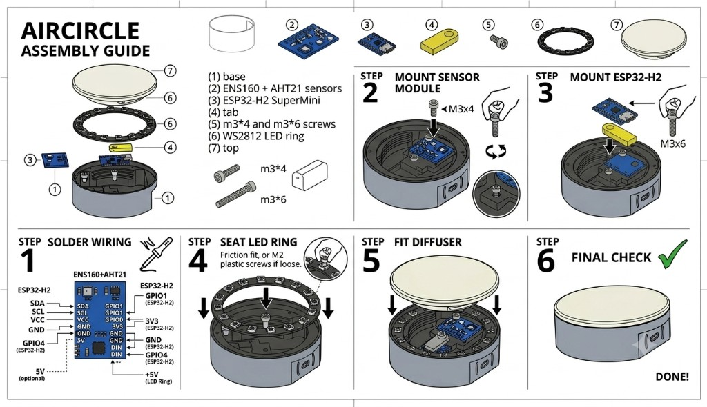

# DIY Build — ESP32-H2 SuperMini

AirCube firmware adapted for breadboard builds with an **ENS160 + AHT21** sensor module and an external **WS2812 LED ring or strip**.

## Parts

Example AliExpress listings for a DIY build (not affiliated with StuckAtPrototype):

| Part | Notes | Link |
|------|-------|------|
| **ESP32-H2 SuperMini** | Select the **H2** variant from the listing | [AliExpress](https://a.aliexpress.com/_c4Pyot8F) |
| **ENS160 + AHT21 sensor module** | Combined air-quality and temp/humidity board | [AliExpress](https://a.aliexpress.com/_c32NbwfH) |
| **WS2812 RGB LED ring** | Pick a ring size that fits your enclosure (e.g. 16-LED) | [AliExpress](https://a.aliexpress.com/_c4Vc3oaj) |

You also need a USB cable for power/data and, for the **AirCircle** enclosure, the 3D-printed parts in `mechanical/air-circle/`.

### Fasteners

| Screw | Used for |
|-------|----------|
| **M3 × 4** | Sensor module → base |
| **M3 × 6** | ESP32-H2 SuperMini → base (via tab) |
| **M2** (short, for plastic) | LED ring → base *(optional)* |

## Wiring and soldering

Solder the connections below before mounting parts in the enclosure.

| Module pin | Connect to ESP32-H2 SuperMini |
|------------|-------------------------------|
| SDA        | **GPIO1** (IO1)               |
| SCL        | **GPIO0** (IO0)               |
| VCC        | **3V3**                       |
| GND        | **GND**                       |
| LED DIN    | **GPIO4** (IO4)               |
| LED +5V    | **5V** (USB) if your strip needs 5 V |
| LED GND    | **GND**                       |

Both ENS160 (0x52) and AHT21 (0x38) share the same I2C bus.

**Boot button (GPIO9):** short press cycles LED brightness; hold **3 seconds** for Zigbee pairing (blue flash).

## Assembly

<p align="center">
  
</p>

1. **Sensor module** — mount in the base with an **M3 × 4** screw.
2. **Tab + ESP32-H2** — insert the printed tab (`air_circ_lock.stl`), place the SuperMini on top (USB-C aligned to the cutout), secure with an **M3 × 6** screw.
3. **LED ring** — seat on the base rim. If the friction fit is loose, use **small M2 screws for plastic**.
4. **Top cover** — fit the diffuser and screw onto the base. Done.

Full step-by-step with printing and flashing: **[README.md](README.md)**.

## LED count

Edit `firmware/main/ws2812_control.h` and change `NUM_LEDS` to match your ring or strip (default **30**; use **16** for a 16-LED ring).

## Build and flash

Requires [ESP-IDF v5.3+](https://docs.espressif.com/projects/esp-idf/en/latest/esp32/get-started/).

```powershell
cd firmware
idf.py set-target esp32h2
idf.py build
idf.py -p COM9 flash monitor
```

## Desktop app

```powershell
cd scripts
pip install -r requirements.txt
python aircube_app.py
```

Select **COM9**, click **Connect** — live temp, humidity, eCO2, TVOC, and VOC Level appear after ~3 minutes warm-up.

## Notes

- **ENS160** is used instead of the official ENS161; AQI-S (relative score) is not available and shows as `-1` over serial.
- **AHT21** replaces the ENS210; temperature/humidity compensation for the gas sensor still works.
- Onboard **GPIO8** WS2812 is unused; the external strip on GPIO4 drives the air-quality color.

Pin definitions live in `firmware/main/board_config.h`.
