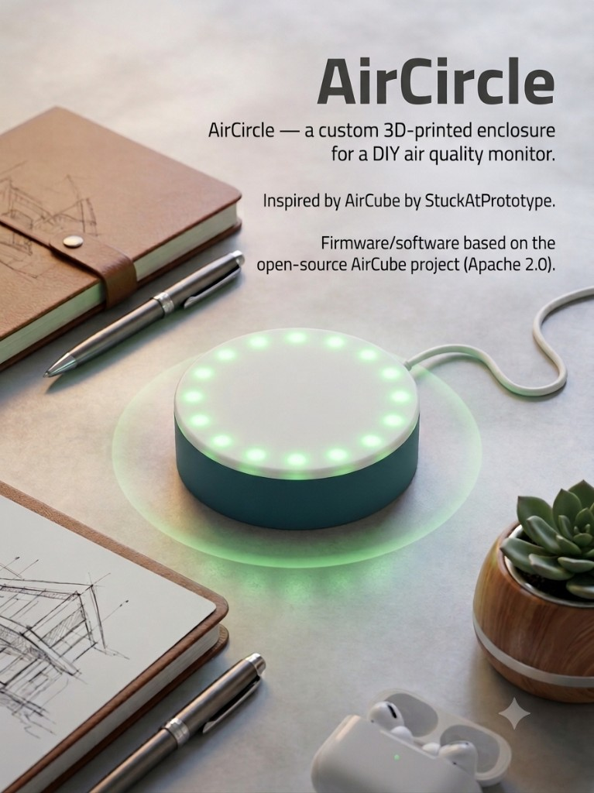

<p align="center">
  
</p>

# AirCircle

**A round, glowy DIY air monitor — built from AliExpress parts and a weekend of printing.**

AirCircle is a maker remix of [AirCube](https://github.com/StuckAtPrototype/AirCube) by [StuckAtPrototype](https://stuckatprototype.com). Same idea: one LED ring tells you how the air feels, and Zigbee feeds the numbers into Home Assistant. Different hardware: an ESP32-H2 SuperMini, off-the-shelf sensors, and a 3D-printed puck you can build yourself.

This is a **personal fork**, not the official AirCube. Think of it as the breadboard cousin of the real thing — a bit scrappier, still pretty handy on a desk.

| | |
|---|---|
| **Upstream project** | [StuckAtPrototype/AirCube](https://github.com/StuckAtPrototype/AirCube) |
| **License** | [Apache 2.0](LICENSE) |
| **Extra build notes** | [DIY_SUPERMINI.md](DIY_SUPERMINI.md) |

> **Not affiliated with or endorsed by StuckAtPrototype.**

---

## What's in this repo

- **AirCircle enclosure** — a round, snap-together case (`mechanical/air-circle/`)
- **SuperMini firmware** — pin map in `firmware/main/board_config.h`
- **ENS160 + AHT21** sensors (the AliExpress-friendly combo)
- **WS2812 LED ring** on GPIO4 — green when life is good, red when you should open a window
- **Full build guide** — source the parts, print, wire, flash

You still get USB serial readings and **Zigbee / Home Assistant** support from the original AirCube firmware.

---

## What you need

### Electronics

Example AliExpress listings — double-check you pick the right variant:

| Part | Notes | Link |
|------|-------|------|
| **ESP32-H2 SuperMini** | Must be the **H2** variant (Zigbee-capable) | [AliExpress](https://a.aliexpress.com/_c4Pyot8F) |
| **ENS160 + AHT21 module** | Combined gas + temperature/humidity sensor | [AliExpress](https://a.aliexpress.com/_c32NbwfH) |
| **WS2812 RGB LED ring** | Match LED count to your ring (e.g. 16-LED) | [AliExpress](https://a.aliexpress.com/_c4Vc3oaj) |

Plus a **USB data cable** for power and flashing.

### 3D-printed parts

Files live in [`mechanical/air-circle/`](mechanical/air-circle/):

| File | Purpose |
|------|---------|
| `air_circ_base.stl` | Bottom shell |
| `air_circ_top.stl` | Translucent top cover — this is what makes the glow |
| `air_circ_lock.stl` | Retention / lock piece |
| `air_circle.stp` | Full assembly source (CAD edits) |

Original StuckAtPrototype enclosure files are in [`mechanical/original/`](mechanical/original/) for reference.

---

## Step 1 — Print the enclosure

1. Slice the three STL files in your slicer of choice.
2. **Material:** PLA or PETG. PETG handles a bit more warmth near the electronics.
3. **Top cover:** translucent or natural filament — that's the whole vibe.
4. **Orientation:** flat on the bed, largest face down. Supports only if your slicer insists.
5. Dry-fit base + top + lock before you start soldering.

Wrong ring size? Scale the STLs or tweak `air_circle.stp`.

---

## Step 2 — Wire the hardware

All logic signals are **3.3 V**. Don't put 5 V on the sensor data lines or the LED data pin.

| Module pin | Connect to ESP32-H2 SuperMini |
|------------|-------------------------------|
| SDA | **GPIO1** (IO1) |
| SCL | **GPIO0** (IO0) |
| VCC | **3V3** |
| GND | **GND** |
| LED DIN | **GPIO4** (IO4) |
| LED +5V | **5V** (USB) — only if your ring needs 5 V power |
| LED GND | **GND** |

Both ENS160 (`0x52`) and AHT21 (`0x38`) share the same I2C bus.

**Button (GPIO9):** short press cycles brightness, hold **3 seconds** for Zigbee pairing (blue flash).

```
  ENS160+AHT21          ESP32-H2 SuperMini          WS2812 ring
  ─────────────         ──────────────────          ───────────
  SDA  ───────────────► GPIO1
  SCL  ───────────────► GPIO0
  VCC  ───────────────► 3V3
  GND  ───────────────► GND ────────────────────► GND
                        GPIO4 ──────────────────► DIN
                        5V (optional) ──────────► +5V
```

Pins: [`firmware/main/board_config.h`](firmware/main/board_config.h)

---

## Step 3 — Configure LED count

Set the LED count to match your ring before building.

Edit [`firmware/main/ws2812_control.h`](firmware/main/ws2812_control.h):

```c
#define NUM_LEDS  16   // change to match your WS2812 ring or strip
```

Default is **30**; a 16-LED ring wants **16**.

---

## Step 4 — Build and flash firmware

Requires [ESP-IDF v5.3+](https://docs.espressif.com/projects/esp-idf/en/latest/esp32h2/get-started/).

```powershell
cd firmware
idf.py set-target esp32h2
idf.py build
idf.py -p COM9 flash monitor
```

Swap `COM9` for your port (`COM*` on Windows, `/dev/tty*` on Linux).

Give it **~3 minutes** after first boot for the ENS160 to warm up — patience, then the readings settle.

### Button controls

| Action | Result |
|--------|--------|
| Short press | Cycle brightness (off → 10% → 30% → 60% → 100%) |
| Hold 3 seconds | Zigbee pairing mode (blue flash) |

---

## Step 5 — View live readings (optional)

Plug in with a data-capable USB cable:

```powershell
cd scripts
pip install -r requirements.txt
python aircube_app.py
```

Pick your COM port, hit **Connect**, and watch the numbers roll in after warm-up.

---

## Home Assistant (optional)

AirCircle inherits AirCube's **Zigbee** stack. Pair with ZHA or Zigbee2MQTT:

**[HOME_ASSISTANT.md](HOME_ASSISTANT.md)**

Hold the boot button for 3 seconds, enable permit join on your coordinator, and you're in.

---

## How this differs from official AirCube

| | Official AirCube | AirCircle (this repo) |
|---|---|---|
| Board | Custom PCB | ESP32-H2 SuperMini |
| Gas sensor | ENS161 | ENS160 |
| Temp/humidity | ENS210 | AHT21 |
| LED | Onboard WS2812 | External WS2812 ring on GPIO4 |
| Enclosure | StuckAtPrototype design | 3D-printed AirCircle puck |
| BLE BTHome | Supported | Disabled in this fork's defaults |
| AQI-S score | Available over USB serial | Not available (`-1` on ENS160) |

Want the polished commercial version? Head to **[StuckAtPrototype/AirCube](https://github.com/StuckAtPrototype/AirCube)**.

---

## LED colors

The ring runs a smooth green-to-red gradient from **VOC Level** (TVOC-derived):

| LED color | Air quality |
|-----------|-------------|
| Green | Good |
| Yellow | Moderate |
| Orange | Poor |
| Red | Time to ventilate |
| Flashing blue | Zigbee pairing |

Full band tables live in the [upstream LED reference](https://github.com/StuckAtPrototype/AirCube/blob/master/README.md#led-reference).

---

## Troubleshooting

**No serial port detected**
- Use a data USB cable, not charge-only.
- Windows: try the [Silicon Labs USB-UART drivers](https://www.silabs.com/developers/usb-to-uart-bridge-vcp-drivers).

**Readings look off right after power-on**
- Normal. ~3 minutes warm-up for the ENS160.

**LED ring wrong or incomplete**
- Check `NUM_LEDS` matches your ring.
- DIN on **GPIO4**, shared GND.

**Zigbee won't pair**
- Hold boot button 3 seconds (blue flash).
- Enable permit join in ZHA or Zigbee2MQTT.
- Move closer to the coordinator.

**Home Assistant missing sensors**
- Load the ZHA quirk or Zigbee2MQTT converter — see [HOME_ASSISTANT.md](HOME_ASSISTANT.md).

---

## Repository layout

```
AirCircle/
├── docs/
│   └── aircircle-hero.png   # Cover image
├── mechanical/
│   ├── air-circle/          # AirCircle enclosure (STL + STEP)
│   └── original/            # Upstream reference enclosure files
├── firmware/                # Adapted ESP-IDF firmware
│   └── main/
│       ├── board_config.h   # SuperMini pin map
│       └── ws2812_control.h # LED count (NUM_LEDS)
├── scripts/                 # Desktop app for USB serial
├── DIY_SUPERMINI.md         # Supplementary build notes
└── HOME_ASSISTANT.md        # Zigbee setup (from upstream)
```

---

## License and attribution

Based on [AirCube](https://github.com/StuckAtPrototype/AirCube) by StuckAtPrototype, licensed under [Apache 2.0](LICENSE).

AirCircle mechanical files and SuperMini adaptations are shared under the same license. Keep the credit and license when you share or remix.
