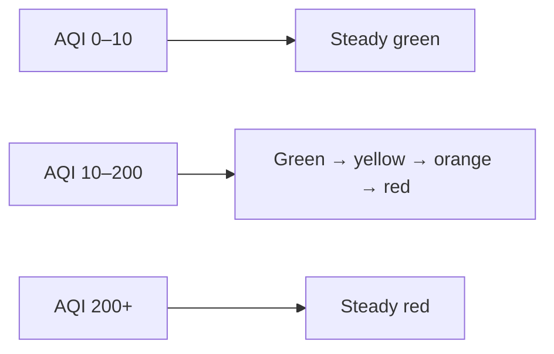

# AirCube

**Know your air.** AirCube is a desktop air quality monitor with built-in **Home Assistant** support over **Zigbee**. It tracks temperature, humidity, eCO2, TVOC, and AQI -- showing air quality as a single, glanceable LED color and reporting every reading to your smart home.

Works standalone out of the box. Pairs with Home Assistant in minutes. Other platforms are supported through **[community-contributed extensions](#community-extensions)**.

[Watch the demo](https://youtu.be/m12KpLyLCrw) (early build -- Home Assistant integration came after this video)

---

## Getting Started

**1. Plug it in** -- Connect the USB-C cable to any USB port or charger. AirCube powers on automatically.

**2. Wait for warm-up** -- The air quality sensor needs about 3 minutes to stabilize after power-on. During this time, the LED may not reflect accurate readings.

**3. Read the color** -- Once warmed up, the LED tells you everything:

| LED Color | Air Quality |
|-----------|------------|
| Green | Good |
| Yellow | Moderate |
| Orange | Poor |
| Red | Bad -- consider ventilating |

The color shifts smoothly as conditions change. No app needed -- just glance at it.

> **Firmware 1.5.0 and above** drive the LED from **canonical AQI** (TVOC-derived, absolute). The color is a smooth green-to-red gradient -- same feel as older firmware, but tied to fixed indoor-air bands instead of the relative AQI-S baseline. See **[LED Reference](#led-reference)** for the exact mapping. Firmware **1.4.3 and below** used the same gradient shape, but driven by **AQI-S** instead.

**4. Adjust brightness** -- Press the button to cycle through brightness levels.

That's it. AirCube works out of the box with no setup, no accounts, and no Wi-Fi.

---

## What AirCube Measures

| Measurement | Range | What It Tells You |
|-------------|-------|------------------|
| **AQI** (Air Quality Index) | 0 -- 500 | Canonical AirCube score, derived from TVOC against fixed indoor-air thresholds (firmware 1.5.0+) |
| **AQI-S** (relative AQI, ScioSense) | 0 -- 500 | Legacy ENS161 relative score using the past 24 h as a baseline |
| **eCO2** (equivalent CO2) | 400 -- 65,000 ppm | Estimated CO2 level derived from detected VOCs |
| **eTVOC** (equivalent Total VOC) | 0 -- 65,000 ppb | Total volatile organic compound concentration |
| **Temperature** | | Room temperature in Celsius |
| **Humidity** | 0 -- 100 % | Relative humidity percentage |

**AQI vs. AQI-S.** Starting with firmware **1.5.0**, AirCube reports two air-quality numbers. **AQI** is the canonical value, computed from TVOC against absolute indoor-air bands (0 = excellent through 500 = unhealthy). It drives the LED color directly. **AQI-S** is the original ScioSense relative index, kept for backward compatibility with existing Home Assistant / Zigbee2MQTT setups.

The LED color follows canonical AQI on a continuous green-to-red gradient. eCO2 and eTVOC are reported separately -- connect to a computer or **Home Assistant** to see the individual numbers. For other hubs, see **Community extensions**.

### Understanding the readings

AirCube uses the **ScioSense ENS161** metal-oxide (MOX) gas sensor paired with the **ENS210** temperature and humidity sensor. The ENS161 contains four independent sensor elements and runs all signal processing on-chip -- the firmware reads finished results over I2C, and the ENS210 feeds live temperature and humidity back into the ENS161 for compensation.

**eCO2 -- equivalent CO2 (ppm)**
The ENS161 does not measure CO2 directly. Instead, it detects the volatile organic compounds (VOCs) and hydrogen that humans produce alongside CO2 through breathing and perspiration. Because VOC and CO2 levels rise and fall together in occupied rooms, the sensor converts its VOC readings into an equivalent CO2 value in parts per million. This lets you use familiar CO2 thresholds to judge air quality:

| eCO2 (ppm) | Rating | What it means |
|-----------|--------|---------------|
| 400 -- 600 | Excellent | Fresh air -- target level |
| 600 -- 800 | Good | Normal indoor air |
| 800 -- 1,000 | Fair | Optional ventilation |
| 1,000 -- 1,500 | Poor | Stale air -- ventilate |
| > 1,500 | Bad | Heavily contaminated -- ventilate now |

A key advantage over a dedicated CO2 sensor is that the ENS161 also detects odors, cooking fumes, and bio-effluents that pure CO2 sensors miss entirely.

**eTVOC -- equivalent Total Volatile Organic Compounds (ppb)**
Thousands of VOCs exist indoors -- from building materials, furniture, cleaning products, paint, cooking, and human metabolism. Many cause headaches, eye irritation, or drowsiness (sometimes called Sick Building Syndrome). The eTVOC reading sums these compounds into a single parts-per-billion value. Higher means more VOCs in the air. A spike after cleaning, cooking, or opening new furniture is normal; sustained high readings mean you should ventilate.

**AQI -- Air Quality Index (0 -- 500, firmware 1.5.0+)**
On firmware **1.5.0 and above**, AirCube reports a canonical **AQI** computed from **TVOC** against fixed indoor-air bands. The LED color tracks this number on a smooth green-to-red gradient (green at 0--10, full red at 200+). Because the scale is absolute, the same AQI number always means the same air -- no 24-hour baseline.

| TVOC (ppb) | AQI range | Rating |
|------------|-----------|--------|
| 0 -- 65 | 0 -- 15 | Excellent |
| 65 -- 220 | 15 -- 50 | Good |
| 220 -- 650 | 50 -- 100 | Moderate |
| 650 -- 2 200 | 100 -- 200 | Poor |
| 2 200 -- 5 500 | 200 -- 500 | Unhealthy |

**AQI-S -- relative Air Quality Index (0 -- 500)**
AirCube also reports the **AQI-S** index, a relative score defined by ScioSense. It uses the average air quality of the past 24 hours as a baseline reference of **100**:

- **Below 100** -- air quality is *better* than the 24-hour average.
- **Above 100** -- air quality is *worse* than the 24-hour average.
- **0** is the best; **500** is the worst.

Because AQI-S is relative, a low number does not guarantee *good* air in an absolute sense -- it means conditions have improved compared to recent history. For absolute thresholds use the new AQI, eCO2, or eTVOC values.

On firmware **1.5.0 and above**, both AQI and AQI-S are reported over Zigbee and serial. Only **AQI** drives the LED. On firmware **1.4.3 and below**, only AQI-S existed and it drove the LED with the same gradient shape (green for 0--10, red at 200+).

### Warm-up and initial start-up

The ENS161 needs about **3 minutes** of warm-up in standard mode before readings stabilize. On the very first power-on of a new sensor the initial start-up takes about **1 hour** as the sensor conditions itself. Readings during these periods may be inaccurate -- the LED and status flag will indicate when the sensor is ready.

---

## Built-in vs. community

**Maintained by StuckAtPrototype:** firmware, hardware, desktop app, and the **Home Assistant** integration documented in **[HOME_ASSISTANT.md](HOME_ASSISTANT.md)**.

**Community-contributed:** integrations built and shared by the community. They live in this repo and are welcome, but StuckAtPrototype does not test or ship them. They may require extra setup and can break when a vendor updates their platform. See **[Community extensions](#community-extensions)**.

---

## Home Assistant Integration

AirCube was designed for Home Assistant. It connects over **Zigbee** -- no USB cable to your server, no cloud, no Wi-Fi credentials to configure. Plug it in, pair it, and all five sensors show up on your dashboard automatically.

Once connected you can:
- **Track air quality over time** with built-in history graphs
- **Set up automations** -- turn on a fan when eCO2 gets too high, send a notification when AQI spikes
- **Monitor every room** -- each AirCube pairs independently, name them however you like

**You'll need:** a Zigbee coordinator dongle (we recommend the [SONOFF ZBDongle-E](https://sonoff.tech/product/gateway-and-sensors/sonoff-zigbee-3-0-usb-dongle-plus-e/), ~$13) plugged into your Home Assistant machine.

**Works with** ZHA (built-in) and Zigbee2MQTT.

**Full setup guide:** **[Connecting AirCube to Home Assistant](HOME_ASSISTANT.md)**

---

## Community extensions

The integrations below are **community-contributed**. They are not maintained by StuckAtPrototype and compatibility with vendor hub or app updates is not guaranteed.

### SmartThings (Samsung Zigbee hub) — community-contributed

Some users run AirCube on a **Samsung SmartThings** Zigbee hub over **Zigbee** (no Wi-Fi configuration on the device). The hub must support **SmartThings Edge**.

By default, the SmartThings app may only show **temperature** and **humidity** until you install the community **AirCube Zigbee** Edge driver from this repository and assign it to the device.

**Full setup guide:** **[Connecting AirCube to SmartThings](SMARTTHINGS.md)** (pairing, SmartThings CLI, driver channel, verification in the app and [Advanced Web App](https://my.smartthings.com/advanced)).

**Troubleshooting:** If you only see temperature and humidity, install the **AirCube Zigbee** Edge driver from [`smartthings/aircube-zigbee/`](smartthings/aircube-zigbee/) and assign it to the device. Details are in **[SMARTTHINGS.md](SMARTTHINGS.md)**.

---

## Connect to Your Computer

Plug the AirCube into your computer with a **data-capable USB-C cable** to see live readings, charts, and history.

### Download the app

Check the [Releases](https://github.com/StuckAtPrototype/AirCube/releases) page for a ready-to-run Windows `.exe` -- no install required.

### Or run from source

```
git clone https://github.com/StuckAtPrototype/AirCube.git
cd AirCube/scripts
pip install -r requirements.txt
python aircube_app.py
```

Select your serial port, click **Connect**, and you'll see live data.

> **Tip:** Prefer a minimal taskbar-only view? See the companion [**AirCube Tray**](https://github.com/StuckAtPrototype/AirCubeTray) repo -- a lightweight Windows system-tray app that shows AQI as a live, color-coded number in your taskbar. It ships its own installer.

---

## Firmware Updates

New firmware releases add features and fix bugs. Updating takes a couple of minutes with just a browser -- no tools to install.

**[Firmware Update Guide](FIRMWARE_UPDATE.md)** -- step-by-step instructions.

Latest release: [GitHub Releases](https://github.com/StuckAtPrototype/AirCube/releases)

---

## LED Reference

### Firmware 1.5.0 and above (current)

The LED is a continuous green-to-red gradient driven by **canonical AQI** (TVOC-derived). Green at the clean end, red at the bad end, with smooth fades in between -- no band plateaus.



| AQI | LED color | Typical TVOC (ppb) | Air quality |
|-----|-----------|-------------------|-------------|
| 0 -- 10 | Steady green | 0 -- ~43 | Excellent |
| 10 -- 50 | Green → yellow | ~43 -- 220 | Good |
| 50 -- 100 | Yellow → orange | 220 -- 650 | Moderate |
| 100 -- 200 | Orange → red | 650 -- 2 200 | Poor |
| 200+ | Steady red | 2 200+ | Unhealthy |
| Flashing blue | -- | -- | Zigbee pairing mode |

AQI is computed from TVOC alone; eCO2 does not affect the LED. AQI-S is still reported over Zigbee and serial for backward compatibility.

### Firmware 1.4.3 and below (legacy)

Same gradient shape as above, but driven by **AQI-S** (relative, 24-hour baseline) instead of canonical AQI:

| LED | Meaning |
|-----|---------|
| Steady green | Good air quality (AQI-S 0--10) |
| Yellow through red | Degrading to poor air quality (AQI-S 10--200) |
| Steady red | Poor air quality (AQI-S 200+) |
| Flashing blue | Zigbee pairing mode |

### Button

| Action | What It Does |
|--------|-------------|
| Short press | Cycle brightness (off, 10%, 30%, 60%, 100%) |
| Hold 3 seconds | Enter Zigbee pairing mode |

---

## Troubleshooting

**LED doesn't turn on**
- Make sure the USB-C cable is firmly connected and the power source is active.
- Try a different USB port or charger.

**Readings seem wrong right after power-on**
- Normal. The air quality sensor needs about 3 minutes to warm up. Readings will stabilize.

**Computer doesn't detect AirCube**
- Some USB cables are charge-only. Use a cable that supports data.
- Windows users may need to install [USB drivers](https://www.silabs.com/developers/usb-to-uart-bridge-vcp-drivers).
- Linux users: add yourself to the `dialout` group and re-login.


**Home Assistant: eCO2, TVOC, or AQI sensors are missing**
- The custom quirk or converter isn't loaded yet. See the [Home Assistant guide](HOME_ASSISTANT.md) for step-by-step instructions.

**Home Assistant: AirCube won't pair**
- Make sure permit join is enabled in ZHA or Zigbee2MQTT.
- Hold the button for 3 seconds to enter pairing mode (LED flashes blue).
- Move AirCube closer to the coordinator during pairing.

---

## Open Source

AirCube is fully open source -- firmware, PCB design, enclosure, desktop software, and Home Assistant integration. Community-contributed integrations (see **[Community extensions](#community-extensions)**) also live in this repository. Everything is under the Apache 2.0 license.

**Developers and makers:** See the **[Contributing Guide](CONTRIBUTING.md)** for build instructions, architecture docs, serial protocol reference, and how to submit changes.

| | |
|---|---|
| [Contributing Guide](CONTRIBUTING.md) | Build from source, firmware architecture, serial protocol, how to contribute |
| [Firmware Update Guide](FIRMWARE_UPDATE.md) | Update your AirCube firmware from a browser |
| [Home Assistant Guide](HOME_ASSISTANT.md) | ZHA and Zigbee2MQTT setup |
| [Samsung hub integration](SMARTTHINGS.md) | Community-contributed: Edge driver, CLI setup (see **[Community extensions](#community-extensions)**) |
| [GitHub Issues](https://github.com/StuckAtPrototype/AirCube/issues) | Bug reports and feature requests |
| [License](LICENSE) | Apache 2.0 |
