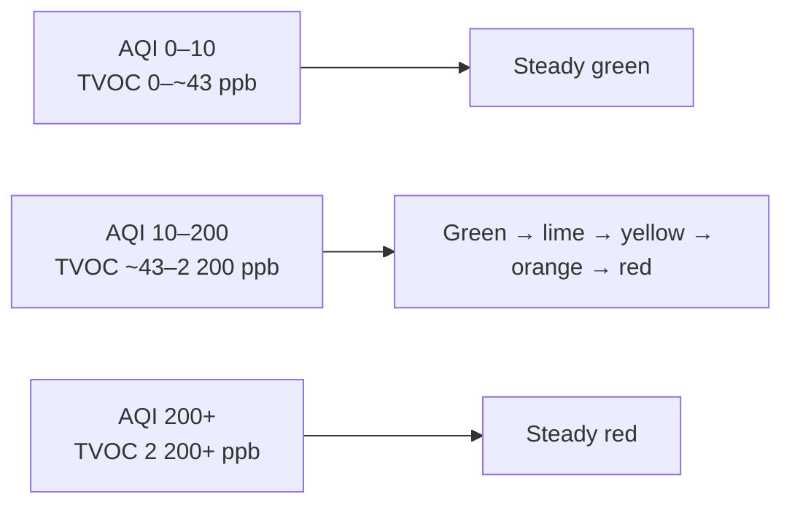

# AirCube

**See your air** AirCube is a desktop air quality monitor with built-in **Home Assistant** support over **Zigbee**. It tracks temperature, humidity, eCO2, TVOC, and AQI -- showing air quality as a single, glanceable LED color and reporting every reading to your smart home.

Works standalone out of the box. Pairs with Home Assistant in minutes. Other platforms are supported through **[community-contributed extensions](#community-extensions)**.

[Watch the demo](https://youtu.be/m12KpLyLCrw) (early build -- Home Assistant integration came after this video)

[AirCube](https://stuckatprototype.com/products/aircube) -- Assembled AirCube
[AirCube Populated PCB](https://stuckatprototype.com/products/aircube-populated-pcb) -- AirCube Populated PCB AirCube
---

## Getting Started

**1. Plug it in** -- Connect the USB-C cable to any USB port or charger. AirCube powers on automatically.

**2. Wait for warm-up** -- The air quality sensor needs about 3 minutes to stabilize after power-on. During this time, the LED may not reflect accurate readings.

**3. Read the color** -- Once warmed up, the LED tells you everything:

| LED Color | Air Quality |
|-----------|------------|
| Green | Good |
| Yellow | Moderate |
| Orange | Poor |
| Red | Bad -- consider ventilating |

The color shifts smoothly as conditions change. No app needed -- just glance at it.

> **Firmware 1.5.0 and above** drive the LED from **canonical AQI** (TVOC-derived, absolute). The color is a smooth green-to-red gradient -- same feel as older firmware, but tied to fixed indoor-air bands instead of the relative AQI-S baseline. See **[LED Reference](#led-reference)** for the exact mapping. Firmware **1.4.3 and below** used the same gradient shape, but driven by **AQI-S** instead.

**4. Adjust brightness** -- Press the button to cycle through brightness levels.

That's it. AirCube works out of the box with no setup, no accounts, and no Wi-Fi.

---

## What AirCube Measures

| Measurement | Range | What It Tells You |
|-------------|-------|------------------|
| **AQI** (Air Quality Index) | 0 -- 500 | TVOC-derived score against fixed indoor-air bands (firmware 1.5.0+; 0--500 scale in 1.5.1+) |
| **AQI-S** (relative AQI, ScioSense) | 0 -- 500 | ENS161 relative score using the past 24 h as a baseline (**USB serial only**) |
| **eCO2** (equivalent CO2) | 400 -- 65,000 ppm | Estimated CO2 level derived from detected VOCs |
| **eTVOC** (equivalent Total VOC) | 0 -- 65,000 ppb | Total volatile organic compound concentration |
| **Temperature** | | Room temperature in Celsius |
| **Humidity** | 0 -- 100 % | Relative humidity percentage |

### Understanding the readings

AirCube uses a **ScioSense ENS161** gas sensor and an **ENS210** temperature/humidity sensor. The ENS210 compensates the ENS161; the firmware reads finished values over I2C.

**eCO2 (ppm)** -- Estimated CO2 derived from detected VOCs, not a direct CO2 measurement. Useful for judging ventilation; also picks up odors and fumes a pure CO2 sensor would miss.

**eTVOC (ppb)** -- Total volatile organic compounds in the air. Spikes after cooking or cleaning are normal; sustained high readings mean you should ventilate.

**AQI (0--500)** -- TVOC mapped to a fixed indoor-air scale (firmware 1.5.1+). Linear ramp between band edges; TVOC-only (eCO2 does not affect AQI). Reported over Zigbee and USB serial.

| Rating | LED color | AQI | TVOC (ppb) |
|--------|-----------|-----|------------|
| Excellent | Green | 0 -- 15 | 0 -- 65 |
| Good | Green → lime | 15 -- 50 | 65 -- 220 |
| Moderate | Lime → yellow | 50 -- 100 | 220 -- 650 |
| Poor | Yellow → orange → red | 100 -- 200 | 650 -- 2,200 |
| Unhealthy | Red | 200 -- 500 | 2,200 -- 5,500 |

The LED color is derived from TVOC/AQI alone (eCO2 does not drive the LED). AQI is linear between band edges, so the LED fades smoothly.

**AQI-S (0--500, USB serial only)** -- ScioSense relative score vs. the past 24 hours (**100** = average). Below 100 is better than recent history; above 100 is worse. Not an absolute clean/dirty reading -- use AQI, eCO2, or eTVOC for that.

Only **AQI** drives the LED color. See **[LED Reference](#led-reference)**.

### Warm-up and initial start-up

The ENS161 needs about **3 minutes** of warm-up in standard mode before readings stabilize. On the very first power-on of a new sensor the initial start-up takes about **1 hour** as the sensor conditions itself. Readings during these periods may be inaccurate -- the LED and status flag will indicate when the sensor is ready.

---

## Built-in vs. community

**Maintained by StuckAtPrototype:** firmware, hardware, desktop app, and the **Home Assistant** integration documented in **[HOME_ASSISTANT.md](HOME_ASSISTANT.md)**.

**Community-contributed:** integrations built and shared by the community. They live in this repo and are welcome, but StuckAtPrototype does not test or ship them. They may require extra setup and can break when a vendor updates their platform. See **[Community extensions](#community-extensions)**.

---

## Home Assistant Integration

AirCube was designed for Home Assistant. It connects over **Zigbee** -- no USB cable to your server, no cloud, no Wi-Fi credentials to configure. Plug it in, pair it, and six entities show up automatically: temperature, humidity, eCO2, tVOC, AQI, and brightness.

Once connected you can:
- **Track air quality over time** with built-in history graphs
- **Set up automations** -- turn on a fan when eCO2 gets too high, send a notification when AQI spikes
- **Monitor every room** -- each AirCube pairs independently, name them however you like

**You'll need:** a Zigbee coordinator dongle (we recommend the [SONOFF ZBDongle-E](https://sonoff.tech/product/gateway-and-sensors/sonoff-zigbee-3-0-usb-dongle-plus-e/), ~$13) plugged into your Home Assistant machine.

**Works with** ZHA (built-in) and Zigbee2MQTT.

**Full setup guide:** **[Connecting AirCube to Home Assistant](HOME_ASSISTANT.md)**

---

## Community extensions

The integrations below are **community-contributed**. They are not maintained by StuckAtPrototype and compatibility with vendor hub or app updates is not guaranteed.

### SmartThings (Samsung Zigbee hub) — community-contributed

Some users run AirCube on a **Samsung SmartThings** Zigbee hub over **Zigbee** (no Wi-Fi configuration on the device). The hub must support **SmartThings Edge**.

By default, the SmartThings app may only show **temperature** and **humidity** until you install the community **AirCube Zigbee** Edge driver from this repository and assign it to the device.

**Full setup guide:** **[Connecting AirCube to SmartThings](SMARTTHINGS.md)** (pairing, SmartThings CLI, driver channel, verification in the app and [Advanced Web App](https://my.smartthings.com/advanced)).

**Troubleshooting:** If you only see temperature and humidity, install the **AirCube Zigbee** Edge driver from [`smartthings/aircube-zigbee/`](smartthings/aircube-zigbee/) and assign it to the device. Details are in **[SMARTTHINGS.md](SMARTTHINGS.md)**.

---

## Connect to Your Computer

Plug the AirCube into your computer with a **data-capable USB-C cable** to see live readings, charts, and history.

### Download the app

Check the [Releases](https://github.com/StuckAtPrototype/AirCube/releases) page for a ready-to-run Windows `.exe` -- no install required.

### Or run from source

```
git clone https://github.com/StuckAtPrototype/AirCube.git
cd AirCube/scripts
pip install -r requirements.txt
python aircube_app.py
```

Select your serial port, click **Connect**, and you'll see live data.

> **Tip:** Prefer a minimal taskbar-only view? See the companion [**AirCube Tray**](https://github.com/StuckAtPrototype/AirCubeTray) repo -- a lightweight Windows system-tray app that shows AQI as a live, color-coded number in your taskbar. It ships its own installer.

---

## Firmware Updates

New firmware releases add features and fix bugs. Updating takes a couple of minutes with just a browser -- no tools to install.

**[Firmware Update Guide](FIRMWARE_UPDATE.md)** -- step-by-step instructions.

Latest release: [GitHub Releases](https://github.com/StuckAtPrototype/AirCube/releases)

---

## LED Reference

### Firmware 1.5.0 and above (current)

The LED is a continuous green-to-red gradient driven by **canonical AQI** (TVOC-derived). The hue moves linearly with AQI: pure green up to AQI 10, then fading green → lime → yellow → orange → red, reaching full red at AQI 200. eCO2 does **not** affect the LED.



| LED color | AQI | TVOC (ppb) | Rating |
|-----------|-----|------------|--------|
| Steady green | 0 -- 10 | 0 -- ~43 | Excellent |
| Green → lime | 10 -- 50 | ~43 -- 220 | Good |
| Lime → yellow | 50 -- 100 | 220 -- 650 | Moderate |
| Yellow → orange → red | 100 -- 200 | 650 -- 2 200 | Poor |
| Steady red | 200+ | 2 200+ | Unhealthy |
| Flashing blue | -- | -- | Zigbee pairing mode |

Key gradient landmarks: **yellow** around AQI 105 (~730 ppb) and **orange** around AQI 150 (~1,460 ppb). Over **Zigbee**, TVOC-derived AQI is reported alongside eCO2, eTVOC, temperature, humidity, and brightness. **AQI-S** is available over **USB serial** only and does not drive the LED.

### Firmware 1.4.3 and below (legacy)

Same gradient shape as above, but driven by **AQI-S** (relative, 24-hour baseline) instead of canonical AQI:

| LED | Meaning |
|-----|---------|
| Steady green | Good air quality (AQI-S 0--10) |
| Yellow through red | Degrading to poor air quality (AQI-S 10--200) |
| Steady red | Poor air quality (AQI-S 200+) |
| Flashing blue | Zigbee pairing mode |

### Button

| Action | What It Does |
|--------|-------------|
| Short press | Cycle brightness (off, 10%, 30%, 60%, 100%) |
| Hold 3 seconds | Enter Zigbee pairing mode |

---

## Troubleshooting

**LED doesn't turn on**
- Make sure the USB-C cable is firmly connected and the power source is active.
- Try a different USB port or charger.

**Readings seem wrong right after power-on**
- Normal. The air quality sensor needs about 3 minutes to warm up. Readings will stabilize.

**Computer doesn't detect AirCube**
- Some USB cables are charge-only. Use a cable that supports data.
- Windows users may need to install [USB drivers](https://www.silabs.com/developers/usb-to-uart-bridge-vcp-drivers).
- Linux users: add yourself to the `dialout` group and re-login.


**Home Assistant: eCO2, TVOC, or AQI sensors are missing**
- The custom quirk or converter isn't loaded yet. See the [Home Assistant guide](HOME_ASSISTANT.md) for step-by-step instructions.

**Home Assistant: AirCube won't pair**
- Make sure permit join is enabled in ZHA or Zigbee2MQTT.
- Hold the button for 3 seconds to enter pairing mode (LED flashes blue).
- Move AirCube closer to the coordinator during pairing.

---

## Open Source

AirCube is fully open source -- firmware, PCB design, enclosure, desktop software, and Home Assistant integration. Community-contributed integrations (see **[Community extensions](#community-extensions)**) also live in this repository. Everything is under the Apache 2.0 license.

**Developers and makers:** See the **[Contributing Guide](CONTRIBUTING.md)** for build instructions, architecture docs, serial protocol reference, and how to submit changes.

| | |
|---|---|
| [Contributing Guide](CONTRIBUTING.md) | Build from source, firmware architecture, serial protocol, how to contribute |
| [Firmware Update Guide](FIRMWARE_UPDATE.md) | Update your AirCube firmware from a browser |
| [Home Assistant Guide](HOME_ASSISTANT.md) | ZHA and Zigbee2MQTT setup |
| [Samsung hub integration](SMARTTHINGS.md) | Community-contributed: Edge driver, CLI setup (see **[Community extensions](#community-extensions)**) |
| [GitHub Issues](https://github.com/StuckAtPrototype/AirCube/issues) | Bug reports and feature requests |
| [License](LICENSE) | Apache 2.0 |
